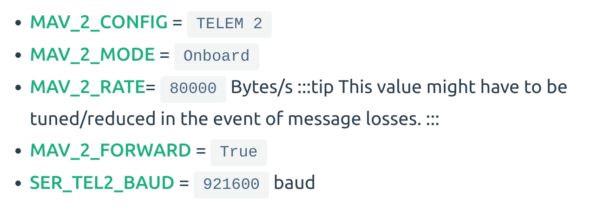
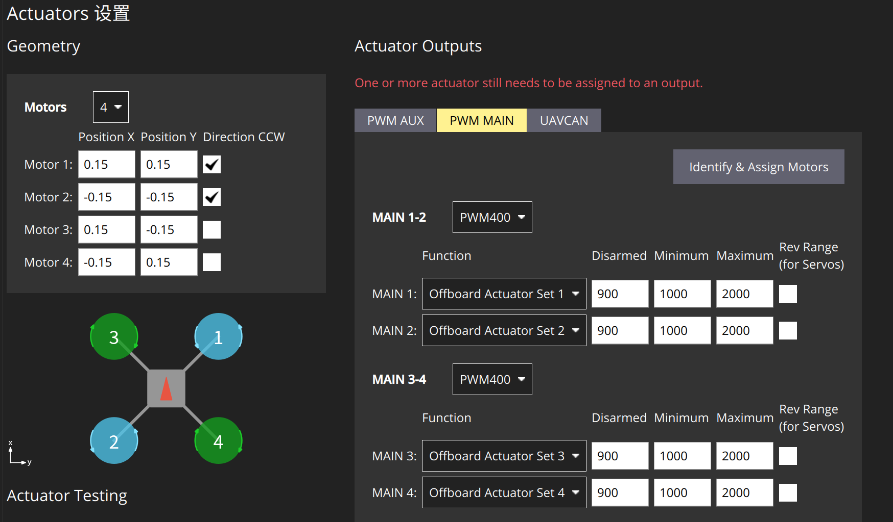

# Control UAV  

------
px4 入门
-------
   1. 阅读相关文档和视频。要认真看！
      1. [PX4官方文档](https://docs.px4.io/)
      2. [mavros官方文档](http://wiki.ros.org/mavros)
      3. [mavlink官方文档](https://mavlink.io/en/)
      4. [从0制作自主空中机器人 | 开源 | 浙江大学Fast-Lab](https://www.bilibili.com/video/BV1WZ4y167me)
      5. [20分钟入门，利用QGC下载px4固件、校准传感器，注意事项](https://www.bilibili.com/video/BV1M54y1R71u)
         - 能达到第五个视频的标准就证明你认真看了
   2. PX4的编译安装
      1. 外设兼容：要求1.13以上（基于1.13.3开发）
      2. clone 官方仓库[px4](https://github.com/PX4/PX4-Autopilot.git)
         ````Shell
           git clone https://github.com/PX4/PX4-Autopilot.git --recursive
         ````
      3. switch to ROS1 branch
         ````Shell
            git checkout v1.13.3
         ````
      4. 运行 tools/setup 下的ubuntu.sh
         ````Shell
         sudo bash ubuntu.sh
         ````
      5. 作为功能包编译px4
         ````Shell
         catkin build
         ````
   3. PX4配套软件安装
      1. QGC的安装 \
         搜索引擎搜索QGroundcontrol 自行安装
      2. mavlink安装 
         ````Shell
         sudo apt install ros-noetic-mavlink
         ````
      3. mavros安装
         1. 二进制安装  
            请使用搜索引擎
         2. 自行编译安装（如果需要用到控制pwm的飞机，只能通过这个方式安装）\
            参考仓库  [Mavros](https://github.com/jackxiongh/mavros)
         3. 安装mavros时需要geographicLib 请自行查阅MAVROSgithub仓库安装
            ```
            Since GeographicLib requires certain datasets 
            (mainly the geoid dataset) so to fulfill certain calculations, 
            these need to be installed manually by the user using geographiclib-tools,
            which can be installed by apt-get in Debian systems. 
            For a quicker procedure, just run the available script in the
            "mavros/scripts" folder, install_geographiclib_datasets.sh.
            ```
   4. 仿真
      1. 参考网址[ROS with gazebo Classic Simulation](http://docs.px4.io/main/en/simulation/ros_interface.html)
         - 注意事项 最后运行的launch文件是mavros_posix_sitl.launch
         - simulation的时间可以为gazebo仿真时间或系统时间，请查看launch文件更改
   5. 无人机的初始设置
      1. 烧录固件（看视频5）
      2. 无人机传感器参数矫正（看视频5）
      3. 无人机电调电池校准（看视频5）
      4. 无人机特殊设置
         - 串口 在QGC中修改
           
         - EKF 在QGC中修改
           - EKF2_AID_MASK = 24
           - EKF2_HGT_MODE = VISION
           - 设置完之后重新进行水平校准
           - 参考网址 [利用视觉或运动捕捉系统进行位置估计](https://docs.px4.io/main/zh/ros/external_position_estimation.html)
         - 直接控制PWM
           - SYS_CTRL_ALLOC = True
           - 
           - 配合本实验室自定义mavros仓库使用 [mavros](https://github.com/jackxiongh/mavros)
           - 如果想使用自定义混控器的方案，请参考 [DevNote.md](DevNote.md)
   6. 连接无人机
      1. 通过有线连接飞机
         ```` Shell
         roslaunch mavros px4.launch fcu_url:="/dev/ttyACM0:921600" gcs_url:="udp://@{地面站的ip}"
         ````
      2.  通过wifi模块连接飞机
           ```` Shell
           roslaunch mavros px4.launch fcu_url:="udp://:{UgCS Port}@{无人机的ip:{Local Port}}" gcs_url:=udp://@{地面站的ip}
           ```` 
          - wifi模块设置
            
            - 其中 需要关注Local port(不需要改) UGCS Port(默认为14540，如果有多架无人机请根据世纪情况修改) 静态ip请根据实际场景设置 
      - 例子
         ```` Shell
         roslaunch mavros px4.launch fcu_url:="udp://:14540@192.168.1.1:14557" gcs_url:=udp://@192.168.1.2
         ````
-----

仓库文件说明
---------

1. 使用MAVLINK提升Px4飞控的数据采样率
   1. 在实际无人机中使用 \
      在qgc中输入
       ```` Shell
       mavlink stream -d /dev/ttyS1 -s SERVO_OUTPUT_RAW_0 -r 50
       ````
   2. 在gazebo仿真中使用
      ```` Shell
      mavlink stream -u 14557 -s SERVO_OUTPUT_RAW_0 -r 50
      ````
2. launch文件使用
   1. mavros.launch 
      > 作为最终实机程序运行的文件
   2. motion_capture
      > 启动动捕文件
   


   
其他
------
1. record data
   ```` Shell
   rosbag record /mavros/imu/data /mavros/setpoint_raw/attitude /px4/vision_odom /mavros/battery /mavros/servo_output_raw -o uav_t2.bag
   ````
2. 机架选择
   
3. 正反浆 \
   从上往下看，顶视顺时针转的电机装反桨，顶视逆时针转的电机装正桨。一般桨上会有ccw和cw字样，ccw正桨，cw反桨